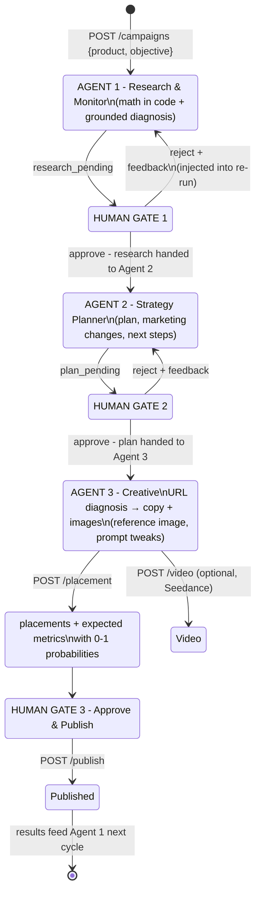
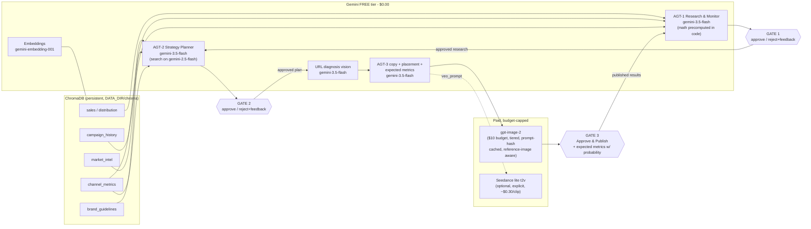

# AdPipeline: Staged 3-Agent Handoff for FMCG Marketing Ops

A demo-grade but production-shaped agentic pipeline - a dev POC for a case study on
**how agents hand off work in a product-based FMCG company's marketing & sales
operations**. Targets Colgate-Palmolive's **Hill's Pet Nutrition** and **Palmolive /
skin-health** portfolios (deliberately **not** oral care).

**The handoff chain:** Agent 1 monitors and researches what's going wrong → a human
approves → the research is handed to Agent 2, which plans the marketing changes and
next steps from the metrics → the human approves → the plan is handed to Agent 3,
which generates the campaign images/video (reference-image aware, prompts fully
tweakable) and puts an **Approve & Publish** button plus **probability-scored
expected metrics** in front of the user. Rejection feedback at any gate re-runs
that agent with the feedback injected.

**Two run modes (toggle at the top of the UI):**
- **Chained pipeline** - the full gated handoff described above.
- **Solo agents** - every agent runs standalone, no gates, no handoffs: run
  Agent 1 for a quick portfolio diagnosis, Agent 2 for a plan built straight from
  the knowledge base, or jump directly to Agent 3 and *just generate an ad*
  (the objective becomes the creative brief). Solo runs are recorded in History
  like any campaign and can still flow into placement → publish.

## State machine



## Handoff & data-flow architecture



## Cost routing: who calls which API and why

| Task | Agent | Model / API | Cost |
|---|---|---|---|
| Research & monitoring diagnosis | AGT-1 | `gemini-3.5-flash` (math precomputed in Python) | **$0** (free tier) |
| Strategy plan + live competitor signal | AGT-2 | `gemini-3.5-flash`; `google_search` grounding on `gemini-2.5-flash` | **$0** |
| Ad copy | AGT-3 | `gemini-3.5-flash` | **$0** |
| Placement + expected metrics | AGT-3 | `gemini-3.5-flash` | **$0** |
| URL diagnosis (vision) | AGT-3 | `gemini-3.5-flash` vision | **$0** |
| RAG embeddings | all | `gemini-embedding-001` @768d | **$0** |
| **Ad images** | AGT-3 | **`gpt-image-2`** - hero/compliance `high` ($0.167-0.25), lifestyle `medium` ($0.042-0.063), storyboard `low` ($0.011). Reference image → `images.edit`, same tiers | the $10 budget |
| Images, free-draft mode | AGT-3 | `gemini-2.5-flash-image` via `IMAGE_PROVIDER=gemini` | **$0** |
| Video (optional) | explicit click | Seedance lite t2v, 5s/720p | ~$0.30/clip |
| Text lifeline on Gemini 429 | any | `gpt-4o-mini` fallback | ~$0.001/call |

**Budget math:** a full `/amazon` set ~ **$0.29** in images, $0.00 in text - the $10
OpenAI key covers ~30 full creative runs, and the prompt-hash cache never pays twice
for the same prompt (+reference). `MAX_IMAGE_CALLS_PER_RUN` caps each run;
`DEMO_MODE=true` serves committed placeholders on any API failure.

## The prompt compiler (asset-specific builders)

There is deliberately NO single "generate marketing image" prompt - Hill's pet
food and Palmolive skincare need different visual logic. The pipeline is:

```
PRODUCT KNOWLEDGE -> CREATIVE CONTEXT -> ASSET-SPECIFIC BUILDER
    -> PRODUCT REFERENCE IMAGE(S) -> IMAGE GENERATION
```

Each asset type has a different JOB (`backend/skills/prompt_builders.py`):
product shoot = desirability · amazon infographic = answer ONE question in 2s ·
meta 4:5 = stop the scroll with ONE idea · meta 9:16 = vertical momentum ·
bundle = sell the system · storyboard = a connected sequence. The prompt-writer
model (gemini-3.5-flash) compiles CONTEXT + BUILDER + base template into one
production-ready prompt per asset; the PRODUCT FIDELITY BLOCK (exact pack, no
invented text/claims/badges) is appended in code, never left to the model.
`amazon_main` is **locked**: its compliance template renders verbatim, never
LLM-rewritten.

## Streaming (the UI is never stuck)

Draft and render run over **SSE** (`POST /creative/stream`,
`/solo/creative/stream`, `/creative/render/stream`): status lines update the
busy banner live, drafted prompts appear one by one as each builder compiles,
and every finished image lands in the grid the moment the API returns it. The
plain JSON endpoints drain the same generators - one code path.

## Creative flexibility (the user's knobs)

- **Reference image** - upload a real product photo before generating; images route
  through `images.edit` (OpenAI) / image+text prompting (Gemini) so renders stay
  faithful to the actual pack. The reference is part of the cache key.
- **Art direction** - a free-text tweak appended to every image prompt of the run.
- **Variations (n=1-4)** - a per-prompt selector at the approval gate; n is passed
  straight to the image API as the requested image count (ONE API request for
  n variations). Cost scales n x tier; n>1 always generates fresh (no cache).
- **Per-asset prompt editing** - every drafted prompt is editable before render;
  every rendered tile has an *edit prompt* action → regenerate just that image
  (cache-aware: identical single-image prompt = $0).
- **Prompt transparency** - `GET /prompts` (and the *Inspect* card on the Overview
  screen) shows the exact system prompt each agent runs with.

## Where your data lives

Everything persistent sits under **one directory: `DATA_DIR`** - set in
`config.py`, never hardcoded elsewhere:

| What | Path |
|---|---|
| SQLite DB (campaigns, decisions, assets, cost log) | `DATA_DIR/adpipeline.db` |
| Chroma vector index (no re-embed on restart) | `DATA_DIR/chroma/` |
| Generated images + uploaded references + video | `DATA_DIR/assets/` |

- **On Railway:** the container filesystem is wiped on every deploy. Add a
  **Volume**, mount it at `/data`, set `DATA_DIR=/data` - everything above survives
  redeploys. Set a usage alert as the spend backstop.
- **Locally:** `DATA_DIR` defaults to `adpipeline/data/` (gitignored). Back up or
  move machines by copying that one folder. To reset the POC, delete it.
- Images/videos are served via `GET /assets/{id}` reading from the volume - never
  bundled into the frontend, never base64'd into the DB.

## Setup (local)

```bash
cd adpipeline
cp .env.example .env        # add GOOGLE_API_KEY (free) + OPENAI_API_KEY (images)

# backend: Python 3.11 (chromadb 0.5.x has no py3.13 wheels)
cd backend
python3.11 -m venv .venv && source .venv/bin/activate   # Windows: .venv\Scripts\activate
pip install -r requirements.txt
python seed_cache.py        # placeholder cache images for DEMO_MODE fallback
./run.sh                    # uvicorn on :8000 (ingests the corpus on first boot)

# frontend (new terminal)
cd ../frontend
npm install
npm run dev                 # Vite on :5173, proxies API to :8000
```

Open http://localhost:5173. `GET /health` shows which providers are live.

## Verify your setup (no paid API calls)

```bash
cd backend
DATA_DIR=/tmp/adp-verify python verify_setup.py   # 10 checks, all must PASS
cd ../frontend && npm run build                   # must compile cleanly
```

The suite asserts: routes registered (chained + solo), all 5 products map to a
campaign family, `campaign_history.md` numbers match the researcher's math table
exactly, all corpus docs are registered and present, brand-key mapping agrees
across agents, URL-diagnosis fallbacks cover every product, every image prompt
template renders, and the DB micro-migration + solo gate guard work.

## Products (5, across 3 portfolios)

| Product | Portfolio | Story |
|---|---|---|
| Hill's Youthful Vitality | hills | steady senior-pet line |
| Hill's Prescription Diet k/d | hills | high-margin therapeutic winner (vet channel) |
| Palmolive Luminous Oils | palmolive | mass-premium, quick-commerce play |
| EltaMD UV Clear SPF 46 | skin_health | prestige winner (#1 derm-recommended) |
| Filorga NCEF-Reverse | skin_health | premium struggler (below break-even flights) |

## Environment

```
GOOGLE_API_KEY=             # REQUIRED - all text/vision/embeddings (Gemini free tier)
OPENAI_API_KEY=             # images (gpt-image-2) + gpt-4o-mini rate-limit lifeline
SEEDANCE_API_KEY=           # optional - video renders only on explicit click
DEMO_MODE=true              # image gen falls back to /cache on any API failure or cap
MAX_IMAGE_CALLS_PER_RUN=6   # hard cap on paid image calls per creative run
DATA_DIR=                   # persistent dir (Railway Volume /data); local default: adpipeline/data
IMAGE_PROVIDER=openai       # or gemini for free-tier draft images
EMBED_PROVIDER=gemini       # delete DATA_DIR/chroma if you ever switch providers
```

All optional model-id overrides are documented in `.env.example`.

## What's left for you (the only two things)

1. **Extend the RAG corpus (optional)** - the 15 files in `backend/rag/corpus/*.md`
   mix REAL public data (Hill's FY2024 financials, 2025 Meta/Amazon ad benchmarks,
   India quick-commerce market data, senior-pet demographics, Filorga impairments,
   the therapeutic pet-diet market, EltaMD's derm-channel story)
   with realistic internal mock data; every file states its provenance at the top,
   and mock figures are cross-checked against the real benchmarks so retrieval never
   contradicts itself. Plain markdown, tables welcome; paragraphs chunk to ~300
   tokens. New files must be registered in `backend/rag/ingest.py::MANIFEST` with
   their logical collections. Keep a **BANNED CLAIMS** section in each
   brand-guidelines file - two agents enforce it. Re-ingest is automatic: the index
   is fingerprinted against the corpus and rebuilds on the next boot after any edit.
2. **Set the API keys on Railway** - `GOOGLE_API_KEY`, `OPENAI_API_KEY`,
   `SEEDANCE_API_KEY` (optional), plus `DATA_DIR=/data` with a Volume mounted at
   `/data`. Never commit `.env`.

## Demo script (< 5 min, ~$0.30 per full campaign)

1. **Start** - pick *Hill's Youthful Vitality*, **Start campaign**. Agent 1 fills the
   Research screen: what's wrong (severity-ranked, cited), where it lags, what's
   working, scale recommendation. Sidebar cost stays at ~$0.00 - all text is free tier.
2. **Gate 1** - **Reject** with feedback (*"Focus the diagnosis on APAC"*), re-run,
   watch Agent 1 adapt. Then **Approve - hand research to Agent 2**; the plan builds
   automatically.
3. **Gate 2** - review the campaign angle, metric-grounded marketing changes and next
   steps. **Approve - hand plan to Agent 3**.
4. **Creative** - upload a reference product photo, add art direction
   (*"golden-hour, senior dog"*), pick `/amazon`, **Generate set**. Click *edit
   prompt* on any tile and regenerate just that image.
5. **Placement + expectations** - run the placement pass: budget split per asset plus
   **expected CTR/CPL/CVR/ROAS with probability bars** - the honest "what to expect".
6. **Approve & publish** - the final gate; the campaign stamps PUBLISHED and its
   results feed Agent 1 next cycle. (POC: recorded in DB; the ad-platform API call
   goes in `orchestrator.publish`.)
7. **History & Library** - below the sidebar divider: every past campaign (resumable
   via *Open*) and every asset with its exact cost; repeats show **CACHE HIT · $0.00**.

## Guardrails

- Two human gates before any money is spent on images; a third before publish.
- Every image call gated by `MAX_IMAGE_CALLS_PER_RUN`; `DEMO_MODE` serves `/cache` on any failure.
- Video never auto-triggers: explicit endpoint, one clip per creative, cached thereafter.
- All agent outputs Pydantic-validated; one retry with the JSON Schema on failure.
- Every LLM/image/video call logged (model, tokens, latency, cost) to SQLite → `GET /cost`.
- Agents answer **only** from retrieved chunks; numbers copied verbatim; banned-claim
  guidelines enforced in the planner + copywriter; expected-metric probabilities are
  instructed to stay calibrated (capped at 0.85 unless the data matches exactly).
- Gemini 429s: 2 backoff retries, then a gpt-4o-mini fallback so a live demo never dies.

## API

```
POST /campaigns                       {product, objective} -> Agent 1 research (research_pending)
GET  /campaigns                       history of everything previously generated
GET  /campaigns/{id}                  full campaign state (resume from History)
POST /campaigns/{id}/research         re-run Agent 1 (consumes rejection feedback)
POST /campaigns/{id}/plan             hand approved research to Agent 2
POST /campaigns/{id}/decision         {stage: research|plan, action: approve|reject, feedback?}
POST /creative                        {campaign_id, url, skill, reference_id?, prompt_tweak?}
POST /creative/stream                 SSE variant: status/profile/copy/prompt events, then done
POST /creative/render                 {creative_id, prompts?[{kind,prompt,n:1-4}]} -> HUMAN-APPROVED render (the only image spend)
POST /creative/render/stream          SSE variant: each finished image arrives as an asset event
POST /solo/research                   {product, objective} -> Agent 1 standalone (no gates)
POST /solo/plan                       {product?, objective?, campaign_id?} -> Agent 2 standalone
POST /solo/creative                   {url, skill, product?, objective?, campaign_id?, reference_id?, prompt_tweak?}
POST /solo/creative/stream            SSE variant of the solo draft stage
POST /placement                       {creative_id} -> placements + expected metrics w/ probability
POST /publish                         {creative_id} -> Approve & Publish (POC: recorded in DB)
POST /video                           {creative_id} -> Seedance render | prompt (if disabled)
GET  /videos/{creative_id}            serve the rendered mp4
POST /reference                       multipart image upload -> {reference_id}
GET  /references/{id}                 serve an uploaded reference
GET  /assets/{id}                     serve generated/cached image (reads from DATA_DIR)
POST /assets/{id}/variant             {prompt?} re-render, optionally with a user-edited prompt
POST /assets/{id}/reuse               duplicate an asset onto the shelf ($0)
DELETE /assets/{id}                   delete an asset (file removed when unreferenced)
POST /refine                          {product, objective} -> Gemini-sharpened campaign objective
GET  /library?brand=&skill=&cache_only=   asset shelf with filters
GET  /library/stats                   assets, image spend, cache hits, dollars saved
GET  /prompts                         the exact system prompt each agent runs with
GET  /skills                          list the 4 creative skills
GET  /cost                            cost readout by model
GET  /health                          status + live providers
```

## Notes for the next agent/developer

- **Provider policy lives in exactly two files**: `backend/config.py` (model ids,
  tiers, costs) and `backend/llm/router.py` (dispatch + fallback). Agents name a
  *task*, never a provider - change routing there only.
- The pipeline state machine is just `Campaign.status` - orchestrator functions
  validate transitions; there is no graph framework to fight.
- Agent system prompts live at the top of `backend/agents/{researcher,planner,creative}.py`
  as constants; the shared grounding contract is `agents/common.py::GROUNDING_RULE`;
  `GET /prompts` exposes them read-only.
- Skills are pure data in `backend/skills/registry.py` - add a skill by adding a
  dict (image_specs + copy_blocks + platform_rules); no orchestration changes needed.
- The image cache key is `sha256(prompt|aspect|quality|ref_hash)` - an uploaded
  reference changes the key, so reference-based renders never collide with plain ones.
- gpt-image-2 accepts ONLY 1024x1024 / 1024x1536 / 1536x1024 - the 4:5 spec renders
  on the portrait canvas; non-square bills 1.5× (handled in `config.tier_cost`).
- Amazon blocks scraping - demo URL diagnosis with `hillspet.com` / `palmolive.com`
  pages, or pass `manual:<pasted text>` as the URL for the manual-entry fallback.
- Local dev on Python 3.13: chromadb 0.5.x won't build; use Python 3.11 (as Railway
  does) or `pip install "chromadb>=1.0"` locally.
- Schema changed from the old Run/Brief flow - delete any pre-existing local
  `adpipeline/data/` once after pulling this version.
